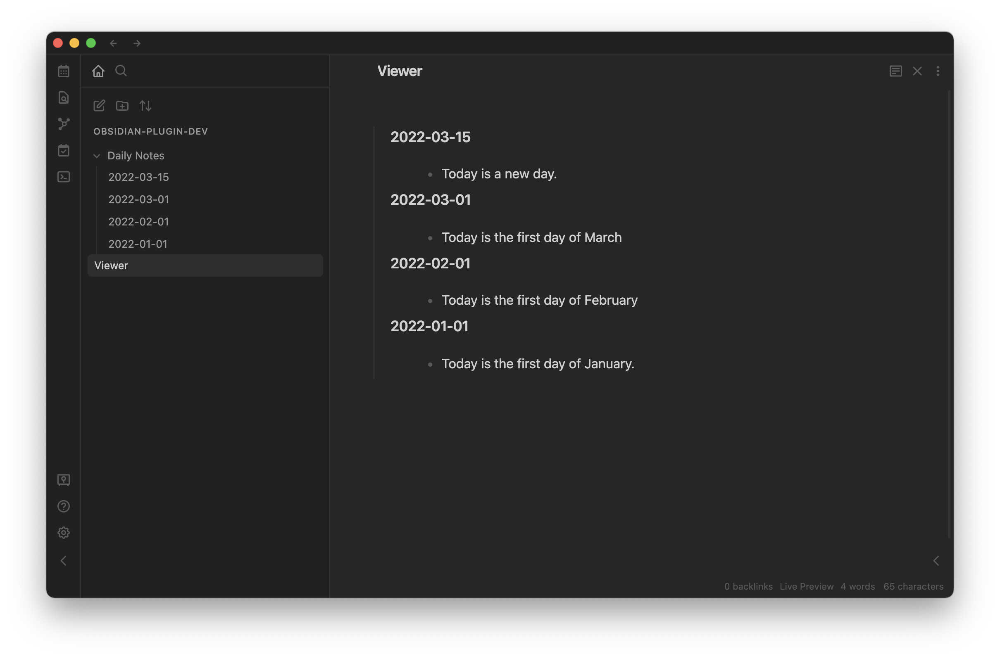

## Daily Notes Viewer

This is a plugin for Obsidian (https://obsidian.md).

It can help you review your daily notes like in roam research.

### Demo

### Note

-   Please make sure that the daily notes plugin in the core plugin has been enabled.
-   The viewer file will be created automatically when enabling the plugin.
-   The viewer file will be updated automatically when creating daily notes or changing settings.

### How to use

-   Enable the plugin.
-   Click the ribbon icon to jump to the viewer file.

### Thanks

-   Thanks to [Liam Cain](https://github.com/liamcain) for the [Obsidian Daily Notes interface](https://github.com/liamcain/obsidian-daily-notes-interface).

-   Thanks to [Boninall](https://github.com/Quorafind) for adding some features.
