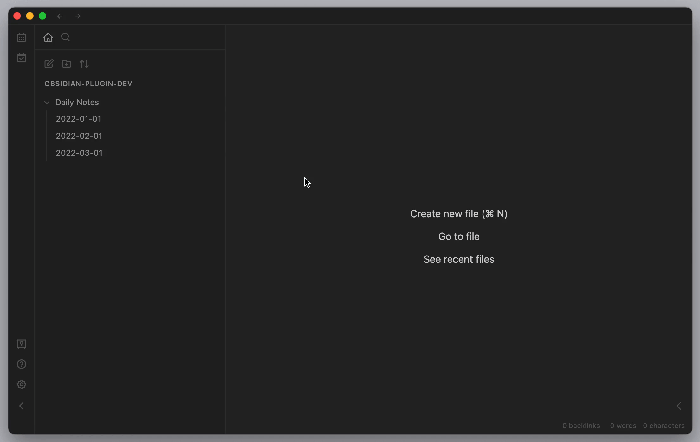

## Daily Notes Viewer

This is a plugin for Obsidian (https://obsidian.md).

It can help you review your daily notes like in roam research.

### Demo

### Note

-   Please make sure that the daily notes plugin in the core plugin has been enabled.

### How to use

-   Click the ribbon icon of "Viewer" or execute the command of "Open Viewer"

### Thanks

-   Thanks to [Liam Cain](https://github.com/liamcain) for the [Obsidian Daily Notes interface](https://github.com/liamcain/obsidian-daily-notes-interface).
